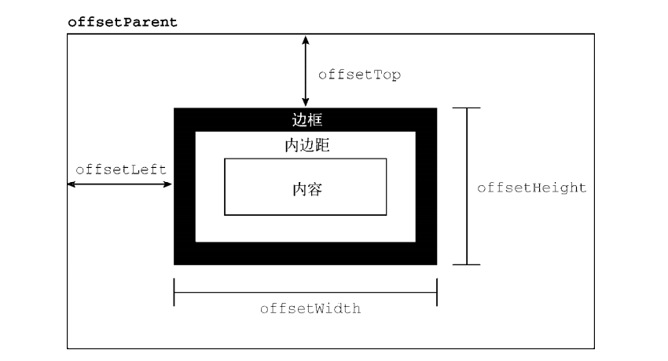
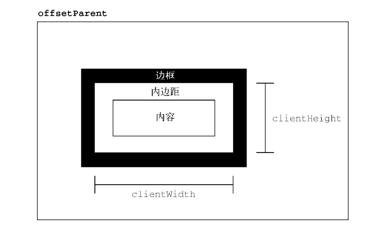

# 06-坐标相关操作

## 一 坐标相关操作

### 1.1 偏移尺寸 offset

offset 即偏移量，可以用来动态获取元素的偏移位置、大小，主要属性包括：

```txt
offsetWidth     返回自身的宽度（width + padding + boder），与他人无关。结果不带单位！
offsetHight     返回自身的高度（height + padding + boder），与他人无关。结果不带单位！
offsetTop       返回距离最近带定位父盒上方的偏移量，且从父亲的padding开始算，若父级没有定位则以body为准
offsetLeft      返回距离最近带定位父盒左侧的偏移量，且从父亲的padding开始算，若父级没有定位则以body为准
offsetParent    返回父级盒子中最近的带有定位的父盒子节点，若父级没有定位则以body为准
```

如图所示：



注意：**元素.style.height 是无法获取高度的，因为元素还会有内容撑开，但是元素使用内嵌式设置高度可以获取:`<div style=”height:50px;”>`**

offset 与 style 区别：

- offset 系列可以返回没有定位盒子的距离上/左的位置（四舍五入取整），`style.` 不可以（因为只有定位的盒子才有 left、top 之类的值）；
- offset 系列返回的是数字，而 `style.` 返回的是字符串+单位 px；
- offset 系列只可获取值，而 `style.` 还可以赋值；
- 如果没有给 HTML 元素指定过 类似 top 样式，则类似 `style.top` 返回的是空字符串。

要确定一个元素在页面中的偏移量，可以把它的 offsetLeft 和 offsetTop 属性分别与 offsetParent 的相同属性相加，一直加到根元素：

```js
function getElementLeft(element) {
  let actualLeft = element.offsetLeft
  let current = element.offsetParent
  while (current !== null) {
    actualLeft += current.offsetLeft
    current = current.offsetParent
  }
  return actualLeft
}

function getElementTop(element) {
  let actualTop = element.offsetTop
  let current = element.offsetParent
  while (current !== null) {
    actualTop += current.offsetTop
    current = current.offsetParent
  }
  return actualTop
}
```

### 1.2 客户端尺寸 client

client 的相关属性用来获取元素的可视区信息，如元素的边框大小、元素大小等：

```txt
clientWidth     返回自身包括padding、内容宽度。数值不带单位。
clientHight     返回自身包括padding、内容高度。数值不带单位。
clientTop       返回元素上边框大小
clientLeft      返回元素左边框大小
```

如图所示：



### 1.3 滚动尺寸 scroll

scroll 用来动态获取元素大小、滚动距离：

```txt
scrollWidth     返回自身实际宽度，不含边框，数值不带单位
scrollHight     返回自身实际高度，不含边框，数值不带单位
scrollTop       返回被卷去的上侧距离，数值不带单位
scrollLeft      返回被卷去的左侧距离，数值不带单位
```

如图所示：


scrollWidth 和 scrollHeight 可以用来确定给定元素内容的实际尺寸。例如， `<html>`元素是浏览器中滚动视口的元素。因此， document.documentElement.scrollHeight 就是整个页面垂直方向的总高度。

scrollWidth 和 scrollHeight 与 clientWidth 和 clientHeight 之间的关系在不需要滚动的文档上是分不清的。如果文档尺寸超过视口尺寸，则在所有主流浏览器中这两对属性都不相等，scrollWidth 和 scollHeight 等于文档内容的宽度，而 clientWidth 和 clientHeight 等于视口的大小。

scrollLeft 和 scrollTop 属性可以用于确定当前元素滚动的位置，或者用于设置它们的滚动位置。元素在未滚动时，这两个属性都等于 0。如果元素在垂直方向上滚动，则 scrollTop 会大于 0，表示元素顶部不可见区域的高度。如果元素在水平方向上滚动，则 scrollLeft 会大于 0，表示元素左侧不可见区域的宽度。因为这两个属性也是可写的，所以把它们都设置为 0 就可以重置元素的滚动位置。

下面这个函数检测元素是不是位于顶部，如果不是则把它滚动回顶部，可以利用 scrollTop 获取并设置值：

```js
function scrollToTop(element) {
  if (element.scrollTop != 0) {
    element.scrollTop = 0
  }
}
```

### 1.4 总结对比

```txt
获取元素距离：      如 offsetWidth，返回自身包括padding、内容区宽度、边框，数值不带单位
获取元素大小：      如 clientWitdh，返回自身包括padding、内容区宽度，数值不带单位
获取滚动距离：      如 scrollWidth，返回自身实际宽度，不喊边框，数值不带单位
```

## 二 page

```txt
pageY/pageX:
    以文档的左上角为基准点，很类似绝对定位,IE6/7/8不支持。
screenY/screenX:
    以电脑屏幕为基准点；鼠标位于屏幕的上方和左侧的距离。
clientX/clientY:
    以可视区为基准点，很类似固定定位。鼠标位于浏览器的左侧和顶部的距离。（浏览器大小和位置）
```

pageY 和 pageX 的兼容写法:在页面位置就等于 = 看得见的+看不见的

```js
pageX = event.clientX + scroll().left
pageY = event.clientY + scroll().top
```
