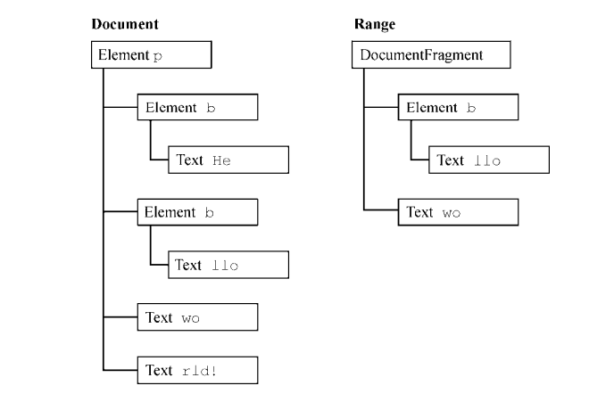

# 05-DOM-7-范围操作

## 一 范围操作概念

为了支持对页面更细致的控制， DOM2 Traversal and Range 模块定义了范围接口。范围可用于在文档中选择内容，而不用考虑节点之间的界限，使用方式：

```js
let range = document.createRange()
```

每个范围都是 Range 类型的实例，拥有相应的属性和方法：

```txt
startContainer：范围起点所在的节点（选区中第一个子节点的父节点）。
startOffset：范围起点在 startContainer 中的偏移量。
            如果 startContainer 是文本节点、注释节点，指范围起点之前跳过的字符数；
            否则，表示范围中第一个节点的索引。
endContainer：范围终点所在的节点（选区中最后一个子节点的父节点）。
endOffset：范围起点在 startContainer 中的偏移量（与 startOffset 中偏移量的含义相同）。
commonAncestorContainer：文档中以startContainer和endContainer为后代的最深的节点。
```

## 二 常见范围操作

### 2.1 简单选择

选择文档中某个部分：

- selectNode()：选择整个节点，包括其后代节点
- selectNodeContents()：只选择节点的后代

示例：

```html
<!DOCTYPE html>
<html>
  <body>
    <p id="p1"><b>Hello</b> world!</p>
    <script>
      let p1 = document.getElementById('p1')

      let range1 = document.createRange()
      let range2 = document.createRange()

      range1.selectNode(p1)
      range2.selectNodeContents(p1)
    </script>
  </body>
</html>
```

如图所示：


调用 selectNode()时， startContainer、 endContainer 和 commonAncestorContainer 都等于传入节点的父节点。在这个例子中，这几个属性都等于 document.body。 startOffset 属性等于传入节点在其父节点 childNodes 集合中的索引（在这个例子中， startOffset 等于 1，因为 DOM 的合规实现把空格当成文本节点），而 endOffset 等于 startOffset 加 1（因为只选择了一个节点）。

在调用 selectNodeContents()时， startContainer、 endContainer 和 commonAncestor Container 属性就是传入的节点，在这个例子中是 `<p>` 元素。 startOffset 属性始终为 0，因为范围从传入 节点的第一个子节点开始 ，而 endOffset 等于传入节点的子节点数量 （ node.childNodes.length），在这个例子中等于 2。

还可以在范围上调用相应的方法：

```txt
setStartBefore(refNode)：把范围的起点设置到 refNode 之前，从而让 refNode 成为选区的第一个子节点                       startContainer 属性被设置为 refNode.parentNode，而 startOffset
                        属性被设置为 refNode 在其父节点 childNodes 集合中的索引。

setStartAfter(refNode)：把范围的起点设置到 refNode 之后，从而将 refNode 排除在选区之外，
                        让其下一个同胞节点成为选区的第一个子节点。 startContainer 属性被设置为refNode.parentNode，
                        startOffset 属性被设置为 refNode 在其父节点 childNodes 集合中的索引加 1。

setEndBefore(refNode)：把范围的终点设置到 refNode 之前。
                        从而将 refNode 排除在选区之外、让其上一个同胞节点成为选区的最后一个子节点。
                        endContainer 属性被设置为 refNode.parentNode， endOffset 属性被设置为 refNode 在其父节点 childNodes 集合中的索引。

setEndAfter(refNode)：把范围的终点设置到 refNode 之后，从而让 refNode 成为选区的最后一个子节点。
                        endContainer 属性被设置为 refNode.parentNode
                        endOffset 属性被设置为 refNode 在其父节点 childNodes 集合中的索引加 1。
```

### 2.2 复杂选择

要创建复杂的范围，需要使用 setStart()和 setEnd()方法。这两个方法都接收两个参数：参照节点和偏移量。对 setStart()来说，参照节点会成为 startContainer，而偏移量会赋值给 startOffset。对 setEnd()而言，参照节点会成为 endContainer，而偏移量会赋值给 endOffset。

使用这两个方法，可以模拟 selectNode()和 selectNodeContents()的行为：

```js
let range1 = document.createRange(),
  range2 = document.createRange(),
  p1 = document.getElementById('p1'),
  p1Index = -1,
  i,
  len
for (i = 0, len = p1.parentNode.childNodes.length; i < len; i++) {
  if (p1.parentNode.childNodes[i] === p1) {
    p1Index = i
    break
  }
}

range1.setStart(p1.parentNode, p1Index)
range1.setEnd(p1.parentNode, p1Index + 1)
range2.setStart(p1, 0)
range2.setEnd(p1, p1.childNodes.length)
```

要选择节点（使用 range1），必须先确定给定节点（ p1）在其父节点 childNodes 集合中的索引。而要选择节点的内容（使用 range2），则不需要这样计算，因为可以直接给 setStart()和 setEnd()传默认值。虽然可以模拟 selectNode()和 selectNodeContents()，但 setStart()和 setEnd()真正的威力还是选择节点中的某个部分。

假设我们想通过范围从前面示例中选择从"Hello"中的"llo"到" world!"中的"o"的部分。很简单，第一步是取得所有相关节点的引用，如下面的代码所示：

```js
let p1 = document.getElementById('p1'),
  helloNode = p1.firstChild.firstChild,
  worldNode = p1.lastChild
```

文本"Hello"其实是 `<p>`的孙子节点，因为它是`<b>`的子节点。为此可以使用 p1.firstChild 取得`<b>`， 而使用 p1.firstChild.firstChild 取得"Hello"这个文本节点。文本节点" world!"是`<p>`的第二个（也是最后一个）子节点，因此可以使用 p1.lastChild 来取得它。然后，再创建范围，指定其边界，如下所示：

```js
let range = document.createRange()
range.setStart(helloNode, 2)
range.setEnd(worldNode, 3)
```

因为选区起点在"Hello"中的字母"e"之后，所以要给 setStart()传入 helloNode 和偏移量 2（ "e"后面的位置， "H"的位置是 0）。要设置选区终点，则要给 setEnd()传入 worldNode 和偏移量 3，即不属于选区的第一个字符的位置，也就是"r"的位置 3（位置 0 是一个空格），如下所示：


### 2.3 操作范围

创建范围之后，浏览器会在内部创建一个文档片段节点，用于包含范围选区中的节点。为操作范围的内容，选区中的内容必须格式完好。在前面的例子中，因为范围的起点和终点都在文本节点内部，并不是完好的 DOM 结构，所以无法在 DOM 中表示。不过，范围能够确定缺失的开始和结束标签，从而可以重构出有效的 DOM 结构，以便后续操作。

仍以前面例子中的范围来说，范围发现选区中缺少一个开始的`<b>`标签，于是会在后台动态补上这个标签，同时还需要补上封闭"He"的结束标签`</b>`，结果会把 DOM 修改为这样：

```js
<p>
  <b>He</b>
  <b>llo</b> world!
</p>
```

而且， " world!"文本节点会被拆分成两个文本节点，一个包含" wo"，另一个包含"rld!"。最终的 DOM 树如图：



这样创建了范围之后，就可以使用很多方法来操作范围的内容。（注意，范围对应文档片段中的所有节点，都是文档中相应节点的指针。）第一个方法最容易理解和使用： deleteContents()。顾名思义，这个方法会从文档中删除范围包含的节点。

```js
let p1 = document.getElementById('p1'),
  helloNode = p1.firstChild.firstChild,
  worldNode = p1.lastChild,
  range = document.createRange()
range.setStart(helloNode, 2)
range.setEnd(worldNode, 3)
range.deleteContents()

// 执行结果：<p><b>He</b>rld!</p>
```

另一个方法 extractContents()跟 deleteContents()类似，也会从文档中移除范围选区。但不同的是， extractContents()方法返回范围对应的文档片段。这样，就可以把范围选中的内容插入文档中其他地方：

```js
let p1 = document.getElementById('p1'),
  helloNode = p1.firstChild.firstChild,
  worldNode = p1.lastChild,
  range = document.createRange()
range.setStart(helloNode, 2)
range.setEnd(worldNode, 3)
let fragment = range.extractContents()
p1.parentNode.appendChild(fragment)

// 结果：<p><b>He</b>rld!</p><b>llo</b> wo
```

如果不想把范围从文档中移除，也可以使用 cloneContents()创建一个副本，然后把这个副本插入到文档其他地方：

```js
let p1 = document.getElementById('p1'),
  helloNode = p1.firstChild.firstChild,
  worldNode = p1.lastChild,
  range = document.createRange()
range.setStart(helloNode, 2)
range.setEnd(worldNode, 3)
let fragment = range.cloneContents()
p1.parentNode.appendChild(fragment)

// 执行结果：<p><b>Hello</b> world!</p><b>llo</b> wo
```

### 2.4 范围插入

使用 insertNode()方法可以在范围选区的开始位置插入一个节点：

```js
// <span style="color: red">Inserted text</span>

let p1 = document.getElementById('p1'),
  helloNode = p1.firstChild.firstChild,
  worldNode = p1.lastChild,
  range = document.createRange()
range.setStart(helloNode, 2)
range.setEnd(worldNode, 3)
let span = document.createElement('span')
span.style.color = 'red'
span.appendChild(document.createTextNode('Inserted text'))
range.insertNode(span)
```

除了向范围中插入内容，还可以使用 surroundContents()方法插入包含范围的内容，这种功能适合在网页中高亮显示某些关键词：

```js
let p1 = document.getElementById('p1'),
  helloNode = p1.firstChild.firstChild,
  worldNode = p1.lastChild,
  range = document.createRange()
range.selectNode(helloNode)
let span = document.createElement('span')
span.style.backgroundColor = 'yellow'
range.surroundContents(span)
```

### 2.5 范围折叠

如果范围并没有选择文档的任何部分，则称为折叠（ collapsed）。折叠范围有点类似文本框：如果文本框中有文本，那么可以用鼠标选中以高亮显示全部文本。这时候，如果再单击鼠标，则选区会被移除，光标会落在某两个字符中间。而在折叠范围时，位置会被设置为范围与文档交界的地方，可能是范围选区的开始处，也可能是结尾处。

折叠范围可以使用 collapse()方法，这个方法接收一个参数：布尔值，表示折叠到范围哪一端。true 表示折叠到起点， false 表示折叠到终点。要确定范围是否已经被折叠，可以检测范围的 collapsed 属性：

```js
range.collapse(true) // 折叠到起点
console.log(range.collapsed) // 输出 true
```

测试范围是否被折叠，能够帮助确定范围中的两个节点是否相邻。例如有以下 HTML 代码：

```js
// <p id="p1">Paragraph 1</p><pid="p2">Paragraph 2</pid>
// 如果事先并不知道标记的结构（比如自动生成的标记），则可以像下面这样创建一个范围：
let p1 = document.getElementById('p1'),
  p2 = document.getElementById('p2'),
  range = document.createRange()
range.setStartAfter(p1)
range.setStartBefore(p2)
console.log(range.collapsed) // true
```

### 2.6 范围比较

如果有多个范围，则可以使用 compareBoundaryPoints()方法确定范围之间是否存在公共的边界（起点或终点）。

```js
let range1 = document.createRange()
let range2 = document.createRange()
let p1 = document.getElementById('p1')
range1.selectNodeContents(p1)
range2.selectNodeContents(p1)
range2.setEndBefore(p1.lastChild)
console.log(range1.compareBoundaryPoints(Range.START_TO_START, range2)) // 0
console.log(range1.compareBoundaryPoints(Range.END_TO_END, range2)) // 1
```

### 2.7 复制范围

### 2.8 清理
