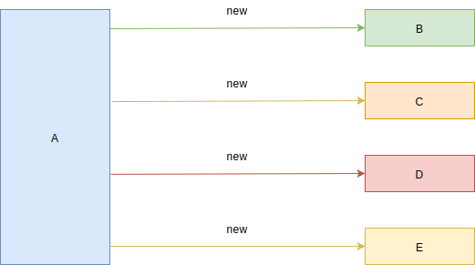

# 06-编程思想-2-依赖注入与控制反转

## 一 控制反转和依赖注入思想

### 1.1 控制反转（Io）概念

控制反转（Inversion of control） 是一种解耦的思想，其意义即字面意思：控制权转移。

以实际生活中的例子介绍：

```txt
1、项目经理要求开发者开发新功能：控制权位于项目经理
2、开发者开始开发需求：控制权位于开发者手中
3、交付成品：控制权回到项目经理
```

在代码中，可以这样表现：假设我们获取数据都是通过一个类 A，但是类 A 内部 依赖于 B（B 是 A 的依赖），如下所示：

```java
// Java语法
class A {
    public String getData(){
        B b = new B();
        return b.data;
    }
}

class B {
    public String data = "类B中的数据";
}

// 获取数据
A a = new A();
String str = a.getData();
```

如果有一天 B 的构造函数发生了变化，可以传参：

```java
class B {
    B(String args){
        // ...
    }
    public String data = "类B中的数据";
}
```

此时修改类 B 导致了依赖于 B 的类 A 失效，也需要对 A 进行额外修改，即我们的一个修改操作引发了另外依赖项于修改处的其他功能失效、发生错误，这是软件的耦合造成的。

有没有办法不去修改引发错误的地方，让 A 与 B 的耦合不再严重？其实，当初的类 A 可以这样设计：

```java
class A {
    private B b;
    A(B b){
        this.b = b;
    }

    public String getData(){
        return this.b.data;
    }
}

class B {
    B(String args){
        // ...
    }
    public String data = "类B中的数据";
}

// 获取数据
A a = new A(new B('b参数'));
String str = a.getData();
```

以上就是一种权限的传递，最开始控制权在 A，A 内部需要 B 的实例，控制权被传递到了 B。

### 1.2 依赖注入(DI)概念

实际开发中，A 可能还会依赖于 C、D、E、F 等，那么权限都传递给 A 就会造成 A 类的工作量剧增、复杂度剧增，这时候可以引入工厂函数，将问题的解决方式交给工厂：

```java
class TempFactory{
    public A createA(){
        return new A(this.createB(),this.createC(),this.createD(),this.createE());
    }
    public B createB(){
        return new B();
    }
    public C createC(){
        return new C();
    }
    public D createD(){
        return new D();
    }
    public E createE(){
        return new E();
    }
}
```

无论是最初对 A 的改造，还是工厂函数，构建实例的本质仍然是开发这自己手动 new，如下所示：



如果依赖进一步复杂，工厂模式也会变得复杂，如果有一个中间者可以给我们自动 new 出这些实例即可，这便是 DI 的思想，如下所示：


所有依赖的类在注入器（Injector）中注册后，当类 A 需要它们的时候，注入器就会帮忙将依赖的类注入进来！

### 1.3 总结

**控制反转和依赖注入是对同一件事情的两个说法**。

在注入器示例中，发生的控制反转是：类 A 需要 B，A 中就需要创建实例 B，控制权在 A 上，如果是通过注入器注入，A 需要 B 的时候，注入器注入进来，控制权移交给了注入器。不过要注意的是：注入器直接注入的，而不是 A 主动去创建的，这里 A 是被动，而注入器是主动的，注入完毕后，控制权又回到了 A 的手上。

现实生活中有个很鲜活的例子就是：找女朋友的事情委托给了婚介所，当婚介所有合适委托者的对象就会找到委托者，将女方资料交给委托者。

依赖注入与控制反转，是一种低耦合设计理念，让开发者能够专注业务，而不是来来回回在依赖中 new。

## 二 基于 TypeScript 实现控制反转

## 三 常见的依赖注入框架
